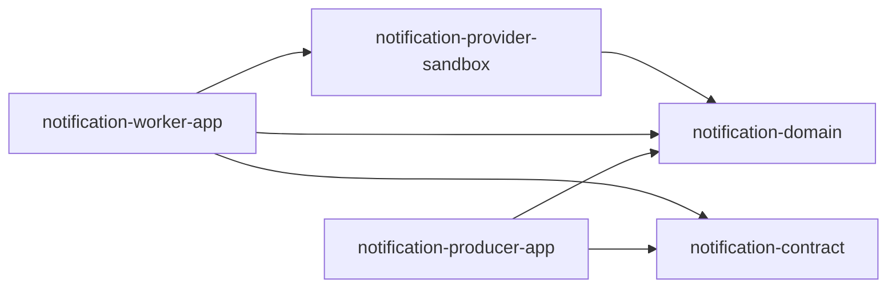
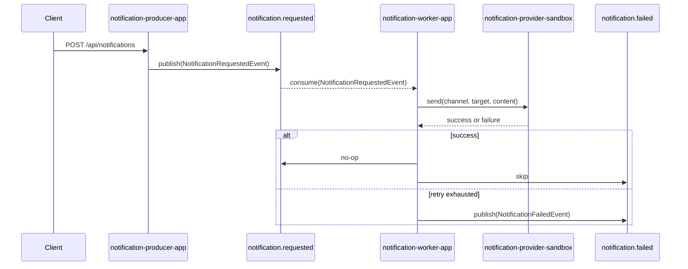

# kafka-notification

## 1. 배경과 목표

`kafka-notification`은 Kafka를 사이에 두고 알림 요청과 실제 전송을 분리하는 실습용 부모 모듈이다.

이 모듈은 아래 흐름을 학습하는 데 목적이 있다.

- Producer 앱이 외부 요청을 받는다.
- 요청을 Kafka 토픽에 적재한다.
- Worker 앱이 토픽을 소비한다.
- Worker가 채널별 Provider를 사용해 실제 전송을 수행한다.
- 실패 시 재시도, 실패 이벤트, DLT 흐름을 실험한다.

즉, 핵심은 `producer app + consumer(worker) app` 구조를 분리하고, 그 경계에 Kafka를 두는 것이다.

현재 상태:

- 구현 전
- 상위 설계만 정의

v1 범위:

- 채널: `EMAIL`, `SLACK`
- 앱: `notification-producer-app`, `notification-worker-app`
- 모듈: `notification-domain`, `notification-contract`, `notification-provider-sandbox`

## 2. 모듈 구조

앱 모듈:

- `kafka-notification:notification-producer-app`
  - 외부 요청을 받는 Spring Boot 앱
  - REST API 제공
  - 알림 요청을 Kafka 토픽으로 발행
  - 세부 문서: [notification-producer-app](../../../../kafka-notification/notification-producer-app/README.md)
- `kafka-notification:notification-worker-app`
  - Kafka consumer 역할의 Spring Boot 앱
  - 알림 요청을 소비
  - 채널별 전송, 재시도, 실패 이벤트 발행, DLT 처리를 담당
  - 세부 문서: [notification-worker-app](../../../../kafka-notification/notification-worker-app/README.md)

라이브러리 모듈:

- `kafka-notification:notification-domain`
  - 순수 도메인 모델과 전송 계약의 중심
  - `NotificationChannel`, `NotificationTarget`, `NotificationContent`, `NotificationTemplate`, `NotificationSendResult`, `NotificationSender`
  - 세부 문서: [notification-domain](../../../../kafka-notification/notification-domain/README.md)
- `kafka-notification:notification-contract`
  - Producer와 Worker가 Kafka로 주고받는 메시지 계약
  - `NotificationRequestedEvent`, `NotificationSentEvent`, `NotificationFailedEvent`
  - `NotificationTopics`, `NotificationHeaderNames`
  - 세부 문서: [notification-contract](../../../../kafka-notification/notification-contract/README.md)
- `kafka-notification:notification-provider-sandbox`
  - 실습용 가짜 Provider 구현
  - `SandboxEmailSender`, `SandboxSlackSender`
  - 성공, 실패, 지연 시나리오를 강제로 재현
  - 세부 문서: [notification-provider-sandbox](../../../../kafka-notification/notification-provider-sandbox/README.md)

중요한 점:

- `notification-producer-app`와 `notification-worker-app`는 서로 독립적으로 실행되는 앱이다.
- `notification-domain`, `notification-contract`, `notification-provider-sandbox`는 독립 실행 앱이 아니다.
- 앱 모듈이 라이브러리 모듈을 가져다 쓰는 구조가 맞다.

권장 의존 구조:



## 3. 왜 app이 2개여야 하는가

Kafka 실습이라면 보통 `producer`와 `consumer`를 프로세스 수준에서 나누는 편이 더 낫다.

이유:

- 실무 구조와 더 비슷하다.
- API 처리와 실제 전송 처리의 생명주기를 분리할 수 있다.
- Worker 수를 늘리거나 줄이는 실험이 쉽다.
- 재시도, DLT, consumer group, lag 같은 Kafka 학습 포인트가 살아난다.
- 알림 전송 실패가 API 응답 시간을 직접 오염시키지 않는다.

반대로 앱 하나로 합치면:

- 구조는 단순하지만 Kafka를 쓰는 이유가 약해진다.
- producer/consumer 분리 학습이 약해진다.
- 워커 확장, 재처리, 장애 격리 실험이 제한된다.

따라서 이 실습에서는 앱을 아래처럼 나누는 편이 맞다.

1. `notification-producer-app`
2. `notification-worker-app`

## 4. 런타임 흐름

핵심 흐름은 다음과 같다.

1. 사용자가 Producer API에 알림 요청을 보낸다.
2. Producer 앱이 요청을 검증하고 `notification.requested` 토픽에 발행한다.
3. Worker 앱이 해당 토픽을 소비한다.
4. Worker는 채널과 내용을 해석한 뒤 적절한 Provider를 선택한다.
5. 전송 성공 시 `notification.sent` 이벤트를 발행한다.
6. 전송 실패 시 1회 재시도 후 `notification.failed` 이벤트를 발행한다.
7. 필요 시 broker DLT를 사용한다.



권장 토픽:

- `notification.requested`
- `notification.sent`
- `notification.failed`
- `notification.requested.dlt`

## 5. 모듈별 책임

### `notification-producer-app`

책임:

- HTTP 요청 수신
- 요청 검증
- Kafka 발행
- 추적 ID 생성

하지 않을 일:

- 실제 Email/Slack 전송
- 재시도 정책 처리
- DLT 처리

### `notification-worker-app`

책임:

- Kafka 메시지 소비
- 채널별 Provider 선택
- 전송 시도
- 성공/실패 이벤트 발행
- 재시도와 DLT 정책 수행

하지 않을 일:

- 외부 사용자용 API 제공

### `notification-domain`

책임:

- 순수 도메인 타입
- 채널, 수신자, 내용, 템플릿, 결과 모델
- Provider 구현이 따라야 하는 인터페이스

규칙:

- Spring, Kafka, Web 의존성을 두지 않는다.
- 비즈니스 개념만 담고 메시징 세부 구현은 넣지 않는다.

### `notification-contract`

책임:

- Kafka 메시지 계약
- 토픽 이름과 헤더 이름
- Producer와 Worker가 공유하는 이벤트 DTO

규칙:

- 이벤트는 전송용 DTO로만 유지한다.
- 도메인 정책과 Provider 구현은 넣지 않는다.

### `notification-provider-sandbox`

책임:

- 실습용 Email/Slack Sender 구현
- 성공, 실패, 지연 패턴 재현

규칙:

- 외부 API 키나 실 연동 코드를 넣지 않는다.
- Worker 앱에서만 사용한다.

## 6. 설정 계약

권장 설정 키:

```yaml
app:
  notification:
    topic:
      requested: notification.requested
      sent: notification.sent
      failed: notification.failed
      dlt: notification.requested.dlt
    retry:
      max-attempts: 2
      backoff-millis: 1000
    sandbox:
      email:
        failure-rate: 0.1
        delay-millis: 150
      slack:
        failure-rate: 0.2
        delay-millis: 50
```

Producer 쪽 추가 설정:

```yaml
app:
  notification:
    producer:
      allowed-channels:
        - EMAIL
        - SLACK
```

Worker 쪽 추가 설정:

```yaml
app:
  notification:
    worker:
      concurrency: 3
      retry-on-failure: true
```

## 7. 시작 순서

가장 빠른 시작 순서는 이렇다.

1. `notification-domain`
2. `notification-contract`
3. `notification-producer-app`
4. `notification-provider-sandbox`
5. `notification-worker-app`

이 순서를 택하면 Producer와 Worker를 빨리 분리해볼 수 있고, Kafka 실습 포인트도 초반부터 살아난다.

## 8. 리뷰 체크리스트

- Producer가 실제 전송 책임을 들고 있지 않은가
- Worker가 HTTP API 책임까지 같이 들고 있지 않은가
- 도메인 타입이 contract 모듈에 섞여 있지 않은가
- Kafka 토픽/헤더 계약이 contract 모듈로 모여 있는가
- Provider 구현이 domain에 섞여 있지 않은가
- `EMAIL`, `SLACK` 외 채널이 v1 범위에 섞여 있지 않은가

## 부록. settings.gradle 제안안

```gradle
include 'kafka-notification:notification-domain'
include 'kafka-notification:notification-contract'
include 'kafka-notification:notification-provider-sandbox'
include 'kafka-notification:notification-producer-app'
include 'kafka-notification:notification-worker-app'
```
