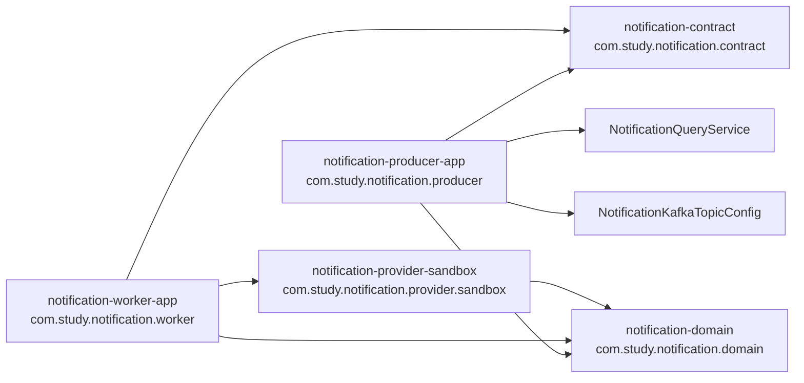
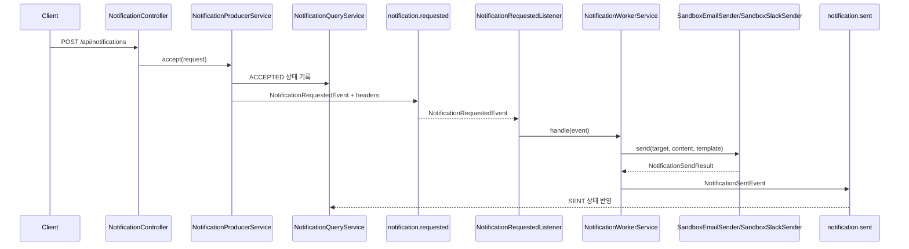
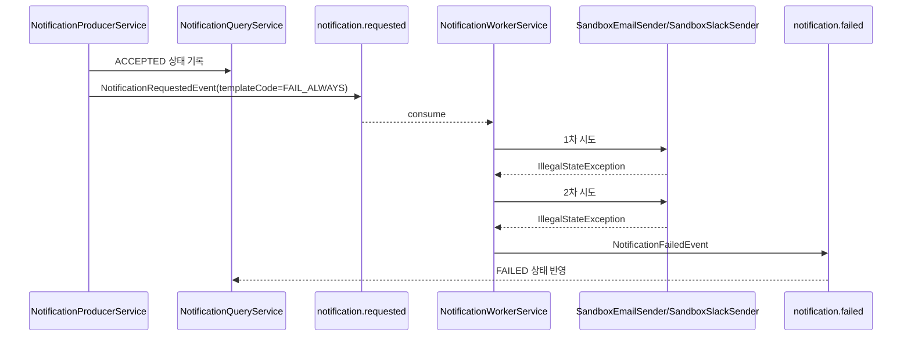

# kafka-notification

## 1. 배경과 목표

`kafka-notification`은 알림 요청 접수와 실제 전송을 Kafka로 분리해 보는 실습용 부모 모듈이다.

이번 단계에서 구현한 범위는 아래와 같다.

- `notification-producer-app`이 `POST /api/notifications` 요청을 받는다.
- `notification-producer-app`이 `GET /api/notifications/{notificationId}` 조회 API를 제공한다.
- 요청을 `notification.requested` 토픽으로 발행한다.
- `notification-worker-app`이 요청 이벤트를 소비한다.
- Worker가 `SandboxEmailSender`, `SandboxSlackSender` 중 하나를 골라 전송을 수행한다.
- 성공 시 `notification.sent`, 실패 시 1회 재시도 후 `notification.failed`를 발행한다.
- Producer가 `notification.sent`, `notification.failed`를 소비해 조회 상태를 갱신한다.
- `templateCode=FAIL_ALWAYS`로 실패 경로를 강제할 수 있다.

현재 상태:

- 구현 완료 (5-Pillar EOS + 3개 개선 적용)
- 로컬 실행 가능
- Docker 실행 가능
- 통합테스트 포함

단계별 문서:

| 단계 | 상태 | 설계 문서 | 아키텍처 문서 | draw.io XML |
|---|---|---|---|---|
| 1단계 | 완료 | [1단계 설계](./phase-1-design.md) | [1단계 아키텍처](./phase-1-architecture.md) | [phase-1 XML](./phase-1-architecture.drawio) |
| 2단계 | 완료 | [2단계 설계](./phase-2-design.md) | [2단계 아키텍처](./phase-2-architecture.md) | [phase-2 XML](./phase-2-architecture.drawio) |
| 3단계 | 완료 | [3단계 설계](./phase-3-design.md) | [3단계 아키텍처](./phase-3-architecture.md) | [phase-3 XML](./phase-3-architecture.drawio) |

클러스터링 문서:

- [Kafka 클러스터링 설계](../../kafka-clustering.md) — 3-브로커 KRaft 구성, ISR, 리더 선출, 순서 보장
- [ZooKeeper vs KRaft](../../kafka-zookeeper-vs-kraft.md) — 역할, 이벤트 영속성, 차이점

EOS 개선 이력:

| # | Pillar | 개선 내용 |
|---|---|---|
| 개선 1 | Pillar 1 | OutboxRelay: `send().get()` → `executeInTransaction()` + `transaction-id-prefix` 추가 |
| 개선 2 | Pillar 2 | NotificationQueryService: ACCEPTED 상태 가드로 멱등 UPDATE 강화 |
| 개선 3 | Pillar 4 | SentNotificationStore 인터페이스 분리 + DbSentNotificationStore(DB 기반 구현) |

자세한 분석: [EOS 구현 검토 및 개선 기록](../../../spring_kafka.wiki/notification-eos-analysis.md)

관련 모듈 문서:

- [notification-domain](../../../../kafka-notification/notification-domain/README.md)
- [notification-contract](../../../../kafka-notification/notification-contract/README.md)
- [notification-provider-sandbox](../../../../kafka-notification/notification-provider-sandbox/README.md)
- [notification-producer-app](../../../../kafka-notification/notification-producer-app/README.md)
- [notification-worker-app](../../../../kafka-notification/notification-worker-app/README.md)

## 2. 모듈 구조

### 2.1 모듈 역할

- `kafka-notification:notification-domain`
  - 순수 도메인 타입
  - `NotificationChannel`, `NotificationTarget`, `NotificationContent`, `NotificationTemplate`, `NotificationSendResult`, `NotificationSender`
- `kafka-notification:notification-contract`
  - Kafka 이벤트 DTO와 토픽/헤더 상수
  - `NotificationRequestedEvent`, `NotificationSentEvent`, `NotificationFailedEvent`
  - `NotificationTopics`, `NotificationHeaderNames`
- `kafka-notification:notification-provider-sandbox`
  - 실습용 Email/Slack Sender 구현
  - `SandboxEmailSender`, `SandboxSlackSender`
- `kafka-notification:notification-producer-app`
  - HTTP 요청 수신
  - 조회 API 제공
  - 유효성 검증
  - Kafka 발행
  - 결과 상태 projection
  - 토픽 생성
- `kafka-notification:notification-worker-app`
  - Kafka 소비
  - 채널별 Sender 선택
  - 재시도
  - 성공/실패 이벤트 발행

### 2.2 의존 방향



### 2.3 주요 클래스 배치

- Producer 앱
  - `NotificationController`
  - `NotificationProducerService`
  - `NotificationResultListener`
  - `NotificationQueryService`
  - `NotificationKafkaTopicConfig`
  - `NotificationProducerProperties`
- Worker 앱
  - `NotificationRequestedListener`
  - `NotificationWorkerService`
  - `NotificationWorkerConfig`
- Sandbox Provider
  - `SandboxEmailSender`
  - `SandboxSlackSender`

## 3. 런타임 흐름

### 3.1 성공 경로



### 3.2 실패 경로



### 3.3 토픽 흐름

- 요청 토픽: `notification.requested`
- 성공 토픽: `notification.sent`
- 실패 토픽: `notification.failed`
- 보류 토픽: `notification.requested.dlt`

현재 구현 상태:

- `notification.requested.dlt` 토픽은 생성만 한다.
- broker DLT 소비 로직은 아직 없다.
- 실패 처리는 Worker 내부 재시도 + `notification.failed` 발행으로 고정한다.
- 조회 API는 Producer의 in-memory projection을 사용하므로 재기동 시 상태가 초기화된다.

## 4. 설정 계약

### 4.1 Producer 앱

```yaml
server:
  port: ${SERVER_PORT:8082}

spring:
  kafka:
    # 3-브로커 클러스터: 1개 다운 시에도 bootstrap 성공
    bootstrap-servers: ${SPRING_KAFKA_BOOTSTRAP_SERVERS:localhost:9092,localhost:9094,localhost:9095}
    consumer:
      group-id: ${SPRING_KAFKA_CONSUMER_GROUP_ID:notification-producer-query-group}

app:
  notification:
    producer:
      allowed-channels:
        - EMAIL
        - SLACK
```

Producer API:

- `POST /api/notifications`
- `GET /api/notifications/{notificationId}`

### 4.2 Worker 앱

```yaml
spring:
  kafka:
    bootstrap-servers: ${SPRING_KAFKA_BOOTSTRAP_SERVERS:localhost:9092,localhost:9094,localhost:9095}
    consumer:
      group-id: notification-worker-group
    listener:
      concurrency: 3  # 파티션 수(3)와 일치 → 파티션당 1 스레드 최적 배정

app:
  notification:
    retry:
      max-attempts: ${APP_NOTIFICATION_RETRY_MAX_ATTEMPTS:2}
      backoff-millis: ${APP_NOTIFICATION_RETRY_BACKOFF_MILLIS:1000}
```

### 4.3 토픽 설정 (클러스터 기준)

| 토픽 | 파티션 | RF | min.insync.replicas |
|---|---|---|---|
| `notification.requested` | 3 | 3 | 2 |
| `notification.sent` | 3 | 3 | 2 |
| `notification.failed` | 3 | 3 | 2 |
| `notification.requested.dlt` | 3 | 3 | 2 |

### 4.4 Docker 실행 경로

루트 compose profile:

```bash
docker compose --profile notification up --build -d
```

Docker 내부/외부 Kafka 연결 규칙:

| 환경 | bootstrap-servers |
|---|---|
| 호스트 앱 | `localhost:9092,localhost:9094,localhost:9095` |
| Docker 내부 앱 | `kafka-1:29092,kafka-2:29092,kafka-3:29092` |

## 5. 확장 및 마이그레이션 전략

### 5.1 다음 확장 후보

- `notification-worker-app`에 broker DLT 소비 추가
- 조회 상태 영속 저장소 추가
- 실 Provider 연동 모듈 추가
- 템플릿 렌더링 계층 추가
- `notification-provider-sandbox`에 지연/확률 기반 실패 설정 추가

### 5.2 채널 추가 기준

새 채널을 추가할 때는 아래 순서를 따른다.

1. `notification-domain`의 `NotificationChannel` 확장
2. `notification-provider-sandbox` 또는 실제 Provider 모듈에 `NotificationSender` 구현 추가
3. `notification-worker-app`에서 Sender bean 등록 확인
4. API 문서와 테스트 업데이트

### 5.3 DLT 전략

현재:

- Worker 내부 재시도 1회
- 실패 이벤트 발행

후속 단계:

- Kafka `DefaultErrorHandler`
- `notification.requested.dlt` 소비 앱 또는 관리자 앱
- 수동 재처리 시나리오

## 6. 검증 결과

검증 명령:

```bash
./gradlew :kafka-notification:notification-producer-app:test
./gradlew :kafka-notification:notification-worker-app:test
./gradlew build
./gradlew projects
docker compose --profile notification up --build -d
docker compose -f docker-compose.notification.yml up --build -d
```

검증 포인트:

- Producer API 호출 시 `notification.requested` 이벤트 발행
- Worker 성공 시 `notification.sent` 발행
- `templateCode=FAIL_ALWAYS` 시 2회 시도 후 `notification.failed` 발행
- Producer 조회 API가 `ACCEPTED`, `SENT`, `FAILED` 상태를 노출하는지 확인
- Docker에서 producer/worker가 같은 Kafka를 바라보는지 확인

## 7. 리뷰 체크리스트

- Producer가 실제 전송 책임을 가지지 않는가
- Worker가 HTTP 엔드포인트를 노출하지 않는가
- 조회 API가 결과 토픽 상태와 일관되게 갱신되는가
- 토픽 이름과 헤더 이름이 `notification-contract` 상수와 일치하는가
- `FAIL_ALWAYS` 규칙이 문서와 코드에서 동일한가
- Docker 내부 Kafka 주소가 `kafka-1:29092,kafka-2:29092,kafka-3:29092`로 맞춰져 있는가
- `notification.requested.dlt`가 구현 범위 밖이라는 점이 문서에 명확한가
- 클러스터 환경에서 bootstrap-servers가 3개 주소를 모두 포함하는가
- notification 토픽이 RF=3, min.insync.replicas=2로 생성되는가
